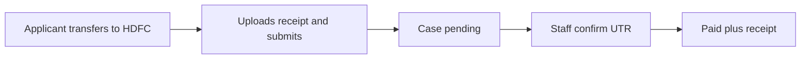

# Release note — Manual bank payment and CRM confirmation

**Date:** 28 September 2026  
**Audience:** AmaraVisa operations and leadership

## What changed

Online checkout no longer treats the fee as paid the moment the applicant clicks through. Applicants transfer to AmaraVisa’s HDFC account, upload a receipt, and submit the application. Staff confirm the UTR on the case Payment tab before the case is treated as paid.

## For applicants (customer site)

- The Payment step shows pay-in details:
  - **Account name:** AMARAVISA INDIA PRIVATE LIMITED
  - **Bank:** HDFC Bank
  - **Branch:** Kudasan 2
  - **Account number:** `99948155035437`
  - **IFSC:** `HDFC0007656`
- They upload a NEFT / IMPS / UPI screenshot or PDF (maximum 5MB), then choose **Submit application**.
- After submit they see: “We received your application. Payment is awaiting confirmation.”
- The official receipt download appears only after staff mark the payment as paid.
- If the receipt is rejected, they re-upload it from the application status page.
- A UPI QR code is hidden until a UPI ID is configured. Card / Razorpay checkout is not live yet.

## For staff (CRM)

- The pipeline still lists cases with pending payment.
- On the case **Payment** tab, staff can view or download the proof, enter the UTR, then **Confirm payment** or **Reject proof** (Pipeline access).
- Confirm marks the case — and siblings in a family booking — as paid, posts the collection, and emails the customer.
- Moving the case to embassy **Submitted** stays blocked until payment is confirmed.

## Flow

## Not in this release

- Live card gateway
- UPI QR
- Showing the HDFC customer ID to applicants

## Ops note

Pay-in fields come from API environment configuration. The HDFC customer ID stays staff-only.

Technical mapping for the customer site, CRM Payment tab, and related APIs: [02-architecture-and-integration.md](../02-architecture-and-integration.md).
